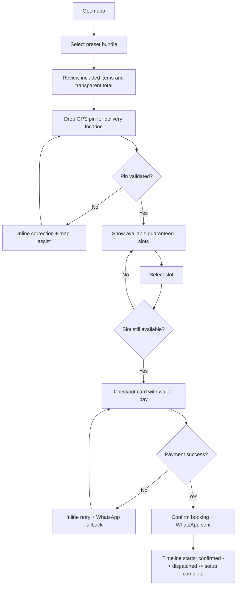
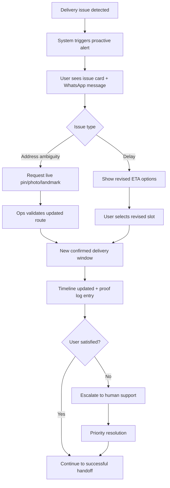
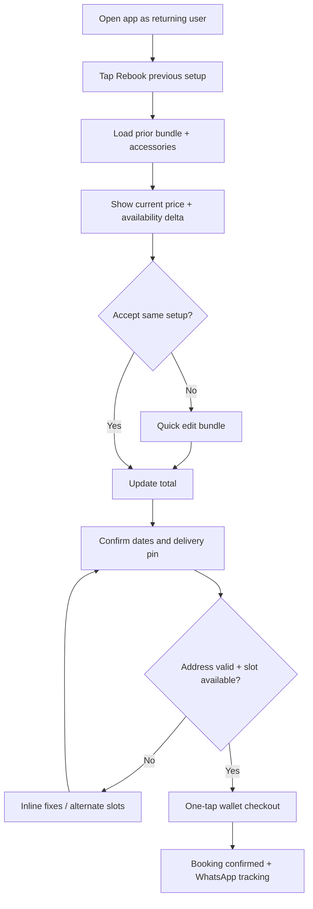

# UX Design Specification workspace-design-tool

**Author:** Clowdy
**Date:** 2026-05-19

---

<!-- UX design content will be appended sequentially through collaborative workflow steps -->

## Executive Summary

### Project Vision

Build a seamless premium rental experience for temporary residents that turns "arriving with no setup" into "production-ready workspace in hours."
The product combines curated ergonomic bundles, transparent booking, and same-day white-glove delivery/setup so nomad professionals can work comfortably from day one.

### Target Users

Primary users are digital nomads, remote tech professionals, and creators staying in hubs like Bali for 1-6 months.
They are mixed-to-tech-heavy users: digitally fluent, high expectations, low patience for friction, and strongly outcome-driven (comfort + productivity + speed).
They typically discover and book from mobile while in transit or right after arrival (airport, cafe, coworking, villa check-in).

### Key Design Challenges

1. Compressing a premium, trust-heavy rental flow into a mobile-first checkout experience without overwhelming users.
2. Building confidence in equipment quality, delivery reliability, and policy clarity fast enough for high-intent, time-sensitive bookings.
3. Supporting rapid decision-making for users under travel stress while still capturing critical delivery/setup details accurately.

### Design Opportunities

1. Position the experience as a "land-and-work" concierge flow: curated bundles + fast date/location booking + guaranteed setup windows.
2. Use trust architecture as a conversion asset: verified quality signals, transparent pricing/policies, delivery certainty, and proof-traceable service states.
3. Differentiate with contextual mobile UX patterns for nomad moments (airport mode, arrival mode, fast rebook from prior setup profiles).

## Core User Experience

### Defining Experience

The core experience is a mobile-first "preset-to-booked" flow for nomad professionals who need a premium workstation with minimal decision fatigue.
The dominant user behavior is selecting a curated preset bundle (e.g., Developer Setup, Creator Setup), confirming dates/location, and completing payment in minutes.
The make-or-break interaction is delivery confidence: users must trust that date/location selection is accurate and that the team can reliably reach difficult Bali villa addresses.

### Platform Strategy

Primary platform is mobile web, with desktop as secondary.
The product is designed for in-transit and on-arrival booking moments (airport, cafe, coworking, villa check-in), so one-handed, fast-completion mobile patterns are prioritized.
Offline support is not required due to dependence on real-time inventory and slot availability.
Device capabilities to leverage now:

- Location autofill and map pin-drop for precise villa delivery points
- Apple Pay / Google Pay wallet checkout for one-tap conversion

### Effortless Interactions

The following interactions must feel immediate and low-cognitive-load:

- Date + delivery slot selection: users should confirm availability and lock a trustworthy window with minimal taps.
- Checkout: wallet-first payment path with transparent totals and no hidden surprises.
- Address validation automation: map-first pinning and smart validation over manual text-heavy entry.
- Equipment compatibility automation: lightweight context questions (e.g., Mac vs PC) auto-resolve dongles/cables.
- SLA/status automation: proactive operational updates via WhatsApp tracking links and timestamped milestones.

### Critical Success Moments

- The "this is better" moment occurs at the bundle-to-checkout transition, when users see:
  - transparent full pricing,
  - guaranteed delivery slot,
  - wallet payment ready.
- This moment must sharply outperform fragmented local alternatives (e.g., ad-hoc vendor coordination and unclear pricing).
- First-time user success is achieved when payment is completed and the user immediately receives an automated WhatsApp confirmation with:
  - delivery window,
  - live tracking link.

### Experience Principles

- Preset-first speed: default to curated bundles to reduce cognitive load and speed first booking.
- Delivery certainty over aesthetics: the address/date/slot confidence loop is the trust core of the product.
- Transparent commitment: show complete pricing and policies before payment, never after.
- Automation where stress is highest: remove manual friction from addressing, compatibility, and status tracking.
- Mobile urgency design: optimize for fast, high-intent decisions in transit contexts.

## Desired Emotional Response

### Primary Emotional Goals

The primary emotional target is control + certainty.
For nomad professionals navigating travel chaos, the product should feel like the one system they can rely on completely.

Referral-driving emotional outcome is "so easy": the experience should feel frictionless enough that users naturally recommend it to peers in coworking and nomad communities.

After checkout, emotional sequence should be:
1. Relief (the setup problem is solved)
2. Confidence (delivery and quality are reliable)
3. Anticipation (looking forward to a premium workday)

### Emotional Journey Mapping

- Discovery/Landing: users should feel trusted instantly through professional presentation, clear trust signals, and platform credibility.
- Bundle Selection + Checkout: users should feel in control through guided presets, transparent pricing, and low-friction payment.
- Delivery Scheduling: users should feel reassured that local address complexity is understood and operationally handled.
- Exception Handling (delay/stock issue): users should feel informed, not abandoned, via proactive updates (especially WhatsApp).
- Post-Booking Return Use: users should feel repeatable confidence that booking again will be equally smooth.

### Micro-Emotions

Most critical emotional levers:

- Trust over skepticism: essential before payment in a new country and unfamiliar service context.
- Confidence over confusion: reinforced through clear bundles, pricing clarity, and predictable flow states.
- Delight beyond satisfaction: created by premium execution details (e.g., full cable-managed setup, not just drop-off).

### Design Implications

Emotion-to-design connections:

- Control + certainty -> deterministic progress states, guaranteed slot confirmation UX, and explicit service-level commitments.
- Trust -> visible verification markers, policy clarity, proof artifacts, and transparent fee architecture from step one.
- Relief -> preset-first paths and minimal required inputs for first booking.
- Confidence -> map pin-drop validation, local delivery confidence messaging, and clear fallback handling.
- Delight -> premium finishing signals in post-booking and fulfillment touchpoints.

Negative emotions to actively prevent:

- Decision fatigue -> solved with one-click persona-based bundles.
- Fear of failed delivery -> solved with GPS pin-drop + local routing confidence + proactive communication.
- Fear of hidden fees -> solved with full, up-front cost disclosure including delivery/pickup.

### Emotional Design Principles

- Certainty by default: every critical decision point should reduce ambiguity.
- Transparency before commitment: all cost and policy information appears before payment.
- Operational confidence in the UI: logistics capability must be made legible, not assumed.
- Frictionless speed with premium cues: fast flow should still feel high-quality and trustworthy.
- Proactive communication over reactive support: users should be informed before they need to ask.

## UX Pattern Analysis & Inspiration

### Inspiring Products Analysis

**Gojek**  
Gojek demonstrates strong UX for high-uncertainty local logistics, including real-time status visibility and practical last-mile coordination. Its core strength is operational confidence in imperfect infrastructure environments.

- Solves: local delivery/navigation uncertainty
- UX win: high-clarity live tracking + practical communication loops
- Relevant lesson: logistics UX must show certainty, not just promise it

**Apple Store App**  
Apple Store excels at premium product framing with low-friction conversion. It combines clean information hierarchy with ecosystem clarity, reducing compatibility concerns while keeping checkout fast.

- Solves: premium purchasing friction and compatibility doubt
- UX win: clean included-items presentation + wallet-first payment
- Relevant lesson: premium trust comes from clarity and restraint, not more copy

**Airbnb**  
Airbnb is strong in trust-forward booking and transparent pricing behavior tied to availability/date interactions. It keeps key decisions and cost visibility within constant reach on mobile.

- Solves: booking confidence and date/price decision clarity
- UX win: sticky pricing/action context during date selection
- Relevant lesson: users should never lose visibility of total cost while deciding

### Transferable UX Patterns

**Navigation Patterns**
- Mobile sticky booking bar with live-updating total and CTA during date/location selection (Airbnb pattern adapted for rental bundles).
- Map-first address confirmation with immediate feedback loop for local precision (Gojek pattern adapted for villa delivery complexity).

**Interaction Patterns**
- GPS pin-drop as primary delivery address method, with optional text enhancement only.
- Instant support handoff/communication thread for hard-to-find addresses.
- Wallet-first checkout path (Apple Pay / Google Pay) as default for high-intent mobile users.
- "What’s included" compatibility card to prevent accessory anxiety (dongles/cables/platform fit).

**Visual Patterns**
- Premium bundle cards with disciplined hierarchy and minimal noise (Apple Store-style composition).
- Transparent dynamic pricing surfaced persistently during scheduling flow (Airbnb-style cost continuity).
- Operational certainty indicators (driver readiness, slot lock status, SLA status) as first-class UI artifacts (Gojek-style logistics confidence).

### Anti-Patterns to Avoid

- Hidden late-stage fees: no new charges should appear at payment stage that were not visible on bundle selection.
- Forced early account creation: users must explore bundles, dates, and total price before authentication friction.
- Vague delivery windows: avoid broad all-day windows; always present narrow, explicit delivery slots.

### Design Inspiration Strategy

**What to Adopt**
- Map-first local logistics certainty and communication loops from Gojek.
- Wallet-native checkout and premium inclusion clarity from Apple Store.
- Persistent transparent pricing context during date selection from Airbnb.

**What to Adapt**
- Adapt logistics patterns for rental delivery + setup (not simple parcel drop-off), including setup-complete proof states.
- Adapt premium visual language to nomad urgency contexts (fast decision paths, not showroom browsing).
- Adapt sticky cost bars to include rental-specific fee transparency and delivery slot confidence.

**What to Avoid**
- Any pricing reveal deferred to final confirmation.
- Any flow that blocks intent exploration behind registration.
- Any scheduling UX that communicates uncertainty or operational ambiguity.

## Design System Foundation

### 1.1 Design System Choice

Adopt a themeable in-house system on top of the current Tailwind + shadcn-style component architecture.

This gives the product a balanced path: fast shipping velocity with strong premium brand control, without migration overhead to a new UI framework.

### Rationale for Selection

- Balanced objective fit (speed + brand): matches the requirement to ship quickly while still creating a high-trust premium surface.
- Team-fit decision: with mostly engineering and limited dedicated design bandwidth, extending the existing stack minimizes cognitive and operational overhead.
- Brand-critical need: premium consistency is required now for the "trusted instantly" emotional target; tokenized styling enables this consistently across screens.
- Low implementation risk: avoids disruptive migration and preserves current component momentum.
- Practical accessibility stance: shadcn-style primitives plus disciplined patterns support strong defaults without blocking speed.

### Implementation Approach

- Formalize a design token layer (color, typography, spacing, radius, shadow, motion, z-index) in Tailwind/theme variables.
- Standardize a core component set for booking-critical flows:
  - Buttons, inputs, selects, date/slot pickers
  - Sticky mobile booking bar
  - Trust badges, status chips, timeline states
  - Pricing breakdown block
  - Address pin-drop and validation containers
- Define interaction states across all key components:
  - loading, success, warning, error, disabled, skeleton
- Create flow-level composition patterns:
  - Preset selection -> scheduling -> checkout -> confirmation/proof center
- Maintain accessibility with practical defaults:
  - semantic structure, keyboard support on critical controls, visible focus states, contrast sanity checks

### Customization Strategy

- Build a premium trust visual language with strict token usage:
  - restrained palette, high legibility, clean spacing rhythm, consistent elevation
- Enforce component-level consistency rules:
  - no ad-hoc color/spacing overrides outside token system
  - no one-off CTA variants for critical conversion actions
- Add nomad-context variants for high-intent mobile usage:
  - compact cards, sticky action bars, quick-confirm patterns
- Implement trust-specific UI primitives as first-class components:
  - reliability panel, delivery certainty cards, fee transparency block, Proof Center states
- Phase approach:
  1) token foundation
  2) critical booking components
  3) page-by-page normalization
  4) refinement and hardening

## 2. Core User Experience

### 2.1 Defining Experience

The defining interaction is:

Drop pin -> get guaranteed setup window -> done.

The product's signature promise is that users can pin their villa location and secure a premium white-glove workstation setup in under 60 seconds.
This is the interaction users should describe to peers because it transforms a historically chaotic manual process into a fast, trustworthy booking moment.

### 2.2 User Mental Model

Users currently carry a mixed mental model:

1. Current pain baseline: "I usually DM vendors and negotiate manually."
2. Logistics expectation: "I expect Airbnb-like instant booking confidence."
3. Transaction expectation: "I expect Apple-like premium checkout."

The experience must bridge from uncertainty and fragmented communication to confidence and structured booking without forcing users to relearn familiar ecommerce patterns.

### 2.3 Success Criteria

Core interaction success is measured by:

- Booking completion in under 2 minutes
- Delivery slot guarantee confirmation before payment
- Automated WhatsApp confirmation sent within 60 seconds after payment

These indicators define whether the product feels fast, reliable, and operationally trustworthy.

### 2.4 Novel UX Patterns

Pattern strategy is hybrid:

- Use established ecommerce and booking patterns for trust and familiarity.
- Introduce focused innovation in the GPS-pin-to-slot flow to create a differentiated "magic moment."

This reduces adoption risk while preserving a distinctive interaction users remember.

### 2.5 Experience Mechanics

**1) Initiation**
- Primary trigger is preset bundle cards (e.g., Developer Bundle, Creator Bundle).
- Selecting a preset immediately initiates the guided booking path.

**2) Interaction**
- User confirms bundle, drops/validates delivery pin, selects guaranteed delivery slot, and proceeds through wallet-first checkout.
- System continuously updates cost, slot confidence, and booking readiness.

**3) Feedback**
- Status chips provide immediate local state feedback (address validated, slot locked, payment ready).
- Progress timeline communicates post-booking fulfillment status (confirmed, dispatched, setup in progress, setup complete).

**4) Completion**
- User completes payment and receives near-immediate WhatsApp confirmation with delivery window and live tracking link.
- Success state confirms the workspace setup is operationally guaranteed, not pending ambiguity.

**5) Error Recovery**
- Inline correction handles standard validation and form-level issues.
- Prominent WhatsApp fallback support handles edge cases (difficult villa access, payment issues, location ambiguity).

## Visual Design Foundation

### Color System

No existing brand guidelines; define a custom system aligned to warm premium tropical.

- Primary: deep emerald/teal family (trust + premium + local relevance)
- Secondary: warm sand/stone neutrals (hospitality + calm)
- Accent: restrained gold/sun highlight for premium emphasis
- Semantic mapping:
  - success = muted green
  - warning = amber
  - error = coral/red
  - info = cool blue/teal
- Usage rule: high-chroma colors only for critical actions/signals (CTA, status, trust indicators), not for large surfaces.
- Contrast stance: practical defaults with clear text/background separation in all conversion-critical surfaces.

### Typography System

Direction: clean sans only.

- Primary typeface: modern sans for all UI, headings, and body.
- Hierarchy strategy:
  - strong, concise headings for confidence
  - readable body text for policy/pricing clarity
  - compact labels for chips/timelines/status
- Tone outcome: modern, efficient, premium without editorial heaviness.
- Readability rules: generous line-height for body copy, tighter line-height for short headings, clear weight contrast between title/body/meta.

### Spacing & Layout Foundation

Direction: spacious premium, built on an 8px spacing system.

- Base unit: 8px rhythm for all spacing, paddings, and component sizing.
- Layout style: breathable card layouts, clear section separation, minimal visual clutter.
- Mobile-first structure: sticky decision surfaces (price + CTA), short interaction blocks, strong vertical rhythm.
- Grid approach:
  - mobile: single-column narrative flow
  - desktop: split trust/decision panels without over-densifying
- Component relationships: consistent vertical spacing for confidence and scanability in high-intent booking moments.

### Accessibility Considerations

Priority: practical good defaults.

- Maintain strong enough contrast on all core transactional paths.
- Preserve visible focus and interaction states on actionable controls.
- Keep tap targets mobile-friendly, especially for slot/date/payment actions.
- Use clear status text + icon redundancy for key trust/booking states.
- Avoid low-contrast decorative text in pricing/policy-critical areas.

## Design Direction Decision

### Design Directions Explored

We explored six design directions spanning trust-heavy dashboards, concierge warmth, technical utility, monochrome premium restraint, timeline-first transparency, and card-stack mobile conversion patterns.

Each direction was evaluated against:
- mobile-first booking speed,
- trust signaling clarity,
- premium brand expression,
- delivery certainty communication,
- and fit with the "drop pin -> lock slot -> done" core interaction.

### Chosen Direction

Selected Direction: Hybrid of Direction 2 + Direction 6
- Direction 2 (Warm Concierge): hospitality-forward premium tone and reassuring service framing
- Direction 6 (Card Stack Mobile): thumb-first progressive card flow optimized for in-transit mobile users

Requested Modification:
Integrate GPS map pin-drop directly into the final transactional card sequence, so address certainty is resolved inside the same high-conversion booking stream.

### Design Rationale

This hybrid is the best fit because it combines:
- a premium, trustworthy hospitality feel required for immediate confidence in a new country context,
- with a low-friction, one-thumb mobile flow that supports fast booking behavior.

It also directly supports the product's signature promise:
- fast setup booking,
- reliable local delivery certainty,
- and minimal cognitive load under travel stress.

### Implementation Approach

- Use card-stack progression as the structural interaction pattern for mobile booking.
- Apply warm concierge visual language (tone, copy, spacing, reassurance cues) across card content and transitions.
- Place GPS pin-drop as a native step in the final booking cards (not a detached flow), with:
  - inline validation states,
  - guaranteed-slot confirmation feedback,
  - and fallback WhatsApp escalation for edge-case locations.
- Keep sticky total + CTA visible through the flow for price transparency and conversion continuity.

## User Journey Flows

### Journey 1: First-Time Booking (Preset -> Pin -> Slot -> Pay)

Journey goal: complete first booking in under 2 minutes with high delivery confidence.
Entry points: landing preset cards, bundle recommendation cards, sticky mobile CTA.
Success state: payment completed + guaranteed slot confirmed + WhatsApp confirmation sent within 60s.
Primary failure risks: unclear address validation, slot unavailable, payment failure.

### Journey 2: Delivery Exception Recovery (Address Issue/Delay -> Resolve)

Journey goal: recover trust fast when operations deviate from plan.
Entry points: tracking timeline alert, WhatsApp notification, in-app support CTA.
Success state: user receives revised confirmed ETA or alternate slot with explicit acknowledgment.
Primary failure risks: radio silence, unclear accountability, repeated manual back-and-forth.

### Journey 3: Repeat Booking (Rebook Previous Setup in 1 Tap)

Journey goal: return users rebook instantly with minimal configuration.
Entry points: home "Rebook previous setup" card, account history, post-rental reminder CTA.
Success state: prior setup rebooked with updated dates/location and instant confirmation flow.
Primary failure risks: hidden changes in availability/price, stale saved address, forced full rebuild.

### Journey Patterns

- Navigation patterns
  - Preset-first entry into guided card stack
  - Sticky total + CTA visible during decisions
- Decision patterns
  - Resolve uncertainty before payment (pin validation, slot lock)
  - Use inline branch handling before escalation
- Feedback patterns
  - Status chips for immediate state
  - Timeline for post-booking operational confidence
  - WhatsApp for proactive external confirmation

### Flow Optimization Principles

- Minimize steps to commitment; move non-essential inputs after booking confirmation where possible.
- Force high-risk uncertainty checks (address + slot) before payment.
- Keep price transparency persistent throughout the flow.
- Default to inline recovery first, then fast human fallback.
- Preserve a single mental model across first-time and repeat journeys.

## Component Strategy

### Design System Components

Use existing Tailwind + shadcn primitives as the foundation layer:

- Core inputs/actions: `Button`, `Input`, `Select`, `Checkbox`
- Surface/structure: `Card`, `Dialog`, `Drawer`, `Tabs`, `Accordion`
- Feedback/assistive: `Toast`, `Tooltip`, `Skeleton`

These cover standard interaction patterns and keep implementation fast while preserving consistency.

### Custom Components

#### GPS Pin-Drop Card (P0)

**Purpose:** Resolve delivery certainty directly in booking flow.
**Usage:** Final transactional card sequence before slot/payment confirmation.
**Anatomy:** map viewport, pin marker, validation status chip, landmark note field, confirm CTA.
**States:** default, locating, pin-set, validating, valid, invalid, fallback-required, disabled.
**Variants:** compact mobile, expanded map mode.
**Accessibility:** keyboard pin movement alternatives, ARIA labels for map controls, screen-reader status announcements.
**Interaction behavior:** pin placement -> validation request -> success/fix guidance -> proceed.

#### Guaranteed Slot Picker (P0)

**Purpose:** Show and lock narrow delivery windows before payment.
**Usage:** after address validation, before checkout.
**States:** loading, available, low-capacity, unavailable, expired-selection, locked.
**Accessibility:** full keyboard navigation, ARIA selected/disabled semantics.

#### Sticky Booking Bar (P0)

**Purpose:** Keep total + CTA persistent throughout mobile flow.
**Usage:** all booking cards from bundle selection onward.
**States:** idle, updating-total, ready, blocked-by-missing-step.
**Accessibility:** semantic landmark role, readable live updates on price changes.

#### Pricing Transparency Block (P1)

**Purpose:** show complete price architecture (rent, fees, deposit, total) continuously.
**Usage:** bundle, scheduling, checkout, confirmation.
**States:** expanded, collapsed, updated, warning (price changed).
**Accessibility:** structured list semantics for cost lines.

#### Trust Timeline (P1)

**Purpose:** communicate operational progress from request to setup complete.
**Usage:** post-booking and exception handling views.
**States:** pending, in-progress, completed, delayed, exception/escalated.
**Accessibility:** ARIA progress semantics + text equivalents for status-only visuals.

#### Delivery Exception Card (P1)

**Purpose:** recover trust when delay/address issue occurs.
**Usage:** timeline interrupt states + notification deep links.
**States:** issue-detected, user-action-needed, resolving, resolved, escalated.

#### WhatsApp Escalation Sheet (P2)

**Purpose:** immediate human fallback for unresolved logistics/payment issues.
**Usage:** from error states and exception cards.
**States:** available, launching, unavailable, retry.

#### Host Reliability Panel / Proof Center Panel (P2)

**Purpose:** reinforce trust and evidence visibility.
**Usage:** pre-book trust section + post-book records.
**States:** summary, expanded, loading, empty.

### Component Implementation Strategy

- Build all custom components on tokenized foundations (color, spacing, typography, radius, motion).
- Enforce full state coverage (`default/loading/error/success/empty/disabled/warning/offline/skeleton`) where applicable.
- Require ARIA and keyboard support for every custom component from first implementation.
- Keep custom components composable, with shared primitives for status chips, timeline nodes, validation messages.

### Implementation Roadmap

**Phase 1 (Conversion + Trust Core):**
- GPS Pin-Drop Card
- Guaranteed Slot Picker
- Sticky Booking Bar
- Pricing Transparency Block

**Phase 2 (Journey Resilience):**
- Trust Timeline
- Delivery Exception Card
- WhatsApp Escalation Sheet

**Phase 3 (Trust Depth + Retention):**
- Host Reliability Panel
- Proof Center Panel
- Repeat-book quick components

## UX Consistency Patterns

### Button Hierarchy

**When to use**
- **Primary CTA (solid):** single highest-value action per screen/card (e.g., `Continue`, `Lock Slot`, `Pay`).
- **Secondary CTA (subtle outline):** non-destructive alternatives (e.g., `Back`, `Edit`, `View details`).
- **Tertiary/text actions:** low-emphasis support actions (e.g., `Need help?`, `Learn more`).

**Visual design**
- Policy `1B`: solid primary + subtle outline secondary.
- Never place two visual-primary buttons in the same viewport region.
- Sticky booking bar always contains one primary action.

**Behavior**
- Primary CTA disabled until critical prerequisites are satisfied.
- Loading state replaces label with progress indicator + preserves button width.
- Destructive actions require confirmation in modal/sheet.

**Accessibility**
- Keyboard reachable in logical order.
- Distinct focus ring and hover/pressed states.
- Icon-only buttons require accessible labels.

### Feedback Patterns

Priority order #1
Feedback is the top consistency category and must be deterministic.

**Pattern rules**
- Success: immediate confirmation + what happens next.
- Warning: clear impact + recommended corrective action.
- Error: explicit cause when known + fastest path to recovery.
- Info: state awareness without urgency.

**Behavior**
- Pair inline status chips (local state) with timeline updates (journey state).
- Always include fallback escalation path for operational uncertainty.
- Never leave users in "pending" without ETA or next-step guidance.

**Accessibility**
- Status color is never the only signal; include icon + text semantics.
- Live-region announcements for important state changes in checkout/delivery flow.

### Form Patterns

Priority order #2
Forms are optimized for speed and certainty in mobile flow.

**Validation timing**
- Policy `2C` hybrid:
  - Realtime inline for critical fields (GPS/address validity, payment readiness, slot lock).
  - On-blur validation for non-critical fields (notes, optional details).

**Guidelines**
- Keep required fields minimal before payment.
- Group fields by decision intent, not backend schema.
- Preserve user input on errors and retries.
- Inline corrective hints appear adjacent to problematic field.

**Accessibility**
- Programmatic label association for all controls.
- Error messages linked to inputs (`aria-describedby`).
- Keyboard and screen-reader complete flows for all custom inputs.

### Navigation Patterns

Priority order #4
- Mobile-first card stack progression is canonical booking navigation.
- Sticky total + CTA is persistent in high-intent flow stages.
- Back navigation preserves prior state (no accidental reset).
- Returning users get direct "Rebook" fast path from entry screen.

### Empty and Loading States

Priority order #5

**Loading behavior**
- Policy `4B`: skeleton-first + optimistic updates where safe.

**Guidelines**
- Skeletons mirror final layout structure (avoid generic loaders).
- Optimistic UI for non-destructive updates (selection, preference toggles).
- Blocking loads only when data is mandatory for irreversible action.
- Empty states must provide one clear next action (not dead-end copy).

### Modal and Overlay Patterns

Priority order #6
- Use modal for high-risk confirmations; sheet/drawer for mobile contextual tasks.
- Avoid stacking multiple overlays.
- Maintain strong escape routes (`Close`, swipe-down where appropriate, back action).
- Operational exceptions use focused issue cards first, modal escalation second.

### Search and Filter Patterns

Priority order #7
- Keep lightweight and optional in primary booking path.
- Preset bundles should outperform raw search for first-time conversion.
- Filters persist while user navigates between list/detail.
- Use progressive filtering, not hard mode switches.

### Integration Rules with Design System

- All patterns implemented using tokenized Tailwind + shadcn primitives.
- Custom components inherit the same CTA, status, validation, and loading rules.
- No one-off interaction behavior outside pattern spec.
- Concierge tone is consistent across feedback and error messaging.

### Pattern Policy Decisions (Locked)

- Priority: `Feedback > Form > Button > Navigation > Empty/Loading > Modal > Search/Filter`
- `1B`: solid primary + subtle outline secondary buttons
- `2C`: hybrid validation timing
- `3B`: warm concierge error messaging voice
- `4B`: skeleton-first loading + optimistic updates where safe

## Responsive Design & Accessibility

### Responsive Strategy

- **Responsive priority:** `2B` mobile-first with desktop enhancement.
- **Approach:** design all critical booking interactions for one-handed mobile first, then progressively enhance information density and parallel visibility on larger screens.
- **Mobile behavior:** prioritize speed-to-booking, sticky decision surfaces, and low cognitive load.
- **Desktop behavior:** use extra space for side-by-side confidence context (pricing, trust, timeline, support) without changing core flow logic.
- **Consistency rule:** same journey logic across devices; only layout and information exposure change.

### Breakpoint Strategy

- **Breakpoint model:** `1A` standard breakpoints.
  - Mobile: `320px - 767px`
  - Tablet: `768px - 1023px`
  - Desktop: `1024px+`

- **Layout adaptation**
  - **Mobile:** single-column card stack; sticky booking bar always visible.
  - **Tablet:** `4C` adaptive per step (single-column for high-focus actions, split layout when trust context improves decision quality).
  - **Desktop:** multi-pane enhanced layout (booking flow + persistent trust/pricing/status context).

### Accessibility Strategy

- **WCAG target:** `5B` WCAG AA.
- **Core requirements**
  - minimum contrast for text and controls meeting AA thresholds
  - full keyboard access for all interactive custom components
  - semantic structure and ARIA support for cards, timelines, status, and map-related interactions
  - minimum touch targets of `44x44px` in mobile contexts
  - visible focus indicators and predictable focus order
  - non-color status communication (icon + label + state text)

### Testing Strategy

- **Testing depth:** `6B` automated + keyboard + screen reader pass.
- **Responsive testing**
  - real-device checks across representative iOS/Android phone sizes and tablet classes
  - desktop browser checks across modern Chrome/Safari/Firefox/Edge
- **Accessibility testing**
  - automated scans in CI for regressions
  - keyboard-only task completion for all critical journeys
  - screen reader verification for booking, exception recovery, and repeat-booking flows
- **Critical flow test cases**
  - first-time booking (preset -> pin -> slot -> pay)
  - delivery exception recovery
  - repeat booking one-tap flow

### Implementation Guidelines

- Build mobile-first with progressive enhancement at standard breakpoints.
- Use relative sizing units and tokenized spacing for consistent scaling.
- Ensure all custom components expose ARIA labels/roles and keyboard interactions from first implementation.
- For map/pin interactions, provide keyboard and assistive alternatives to direct map dragging.
- Keep sticky action controls non-obtrusive and screen-reader discoverable.
- Validate focus management in modals/sheets and after asynchronous state changes.
